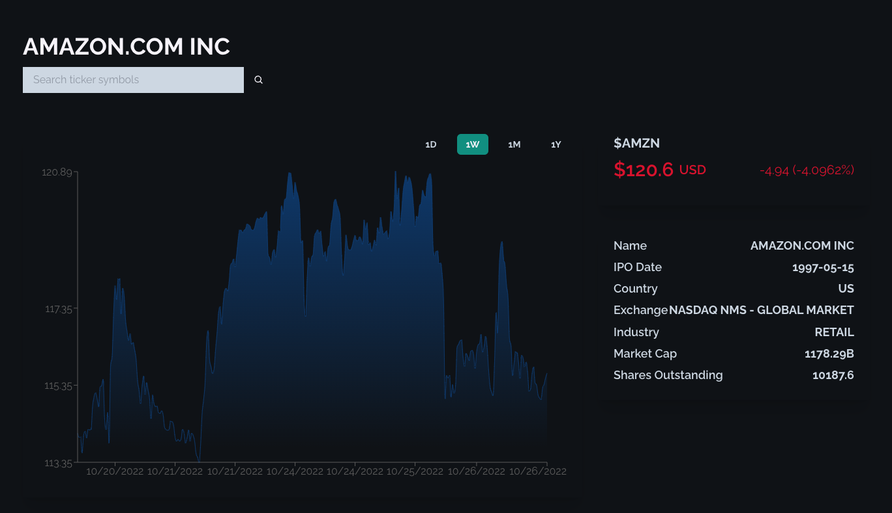

<h1 align="center">
Stock Market Screener 
  <br>
</h1>
<h4 align='center'>
US stock market screener/terminal made with React, TailwindCSS & Finnhub API



<p align="center">
  <a href="#technology-used">Technology</a> |
  <a href="">Live Demo</a> |
  <a href="#contact">Contact</a> |
</p>

# Technology


<br>

# How To Use

### With Git:

To clone and run this application, you'll need [Git](https://git-scm.com) and [Node.js](https://nodejs.org/en/download/) (which comes with [npm](http://npmjs.com)) installed on your computer. From your command line:

```bash
# Clone this repository
$ git clone https://github.com/trdotpy/stock-screener

# Go into the repository
$ cd stock-screener

# Install dependencies
$ npm install

# Run the app
$ npm start
```

# Contact

[](https://github.com/trdotpy/)
[](mailto:tanvi.rahman@outlook.com)
